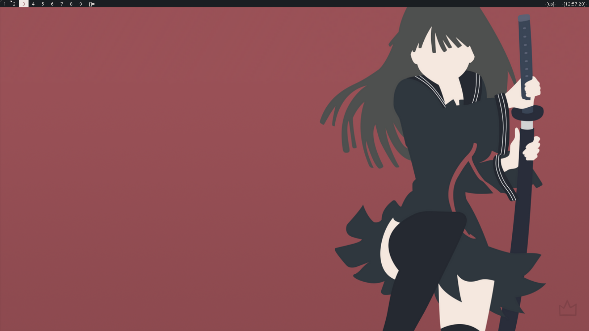
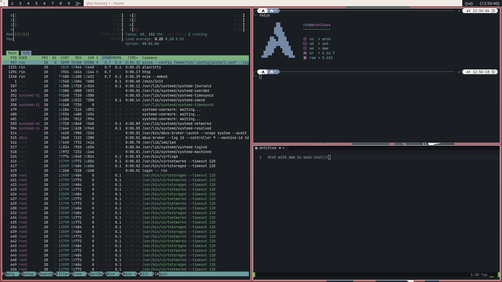

# My dwm fork
## PREVIEW


## PATCHES
- pertag
- fullgaps

## INSTALLATION
1. Clone my repository
2. Change your directory ```cd /path/to/dwm-fork```
3. Type ```make``` and ```sudo make install```
4. Running
   - If you use startx add to .xinitrc ```exec dwm```
   - If you use greetkeeper create session
